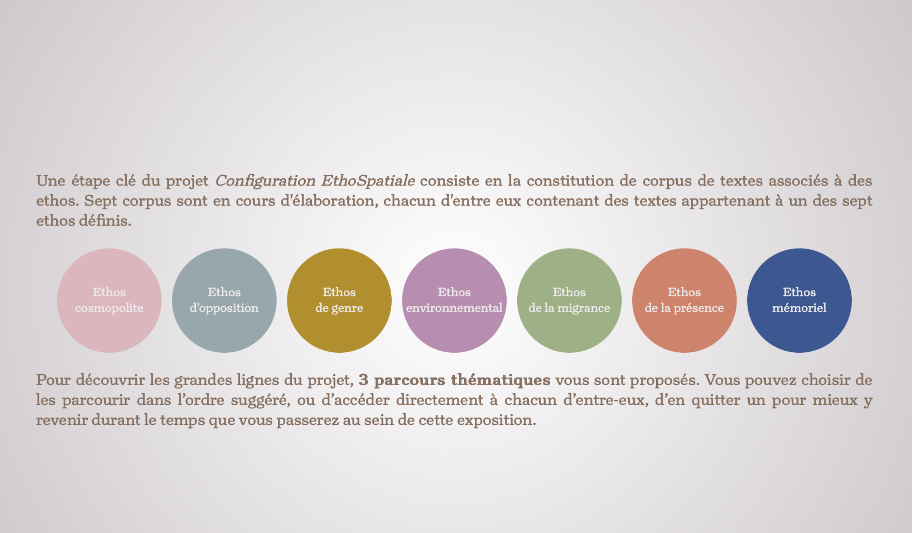
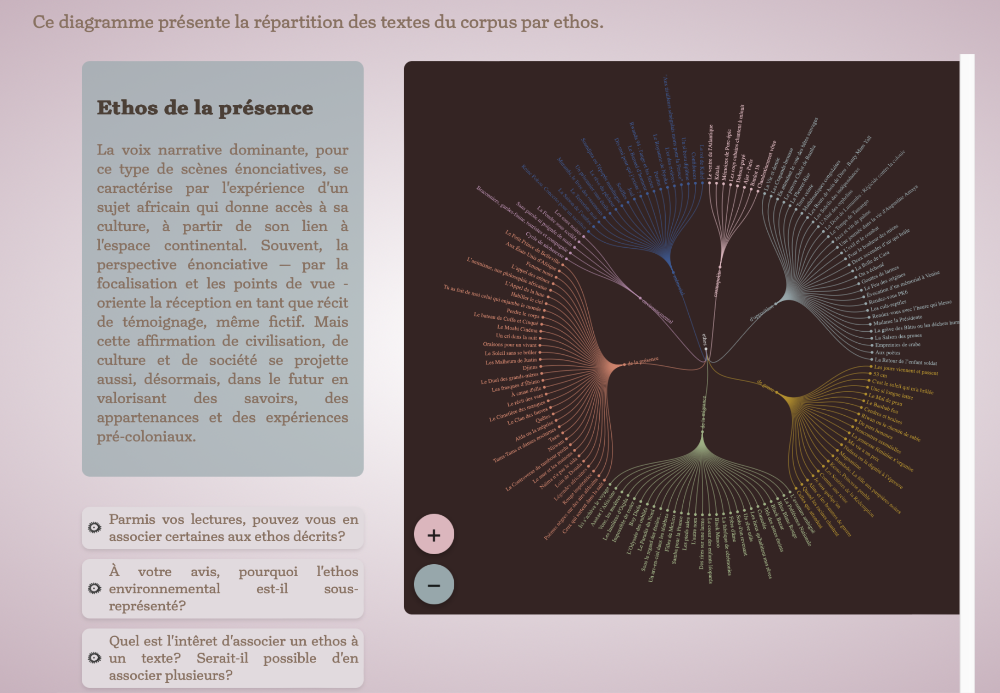
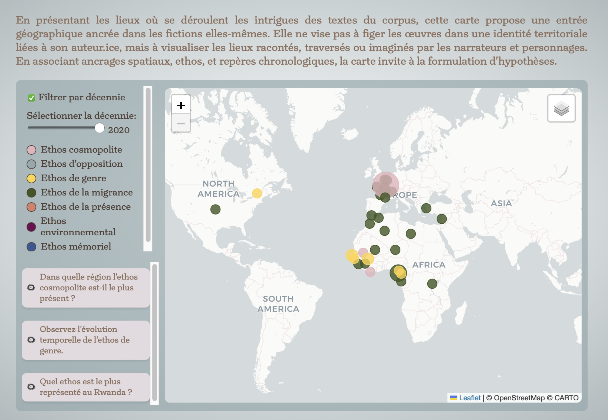
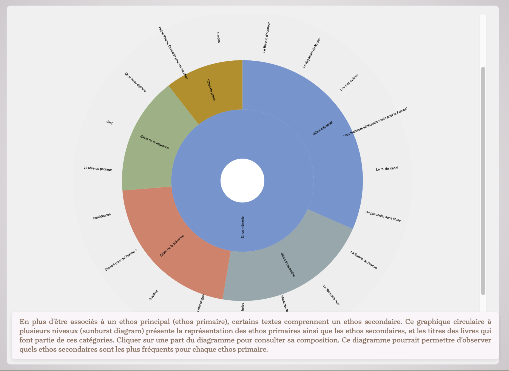
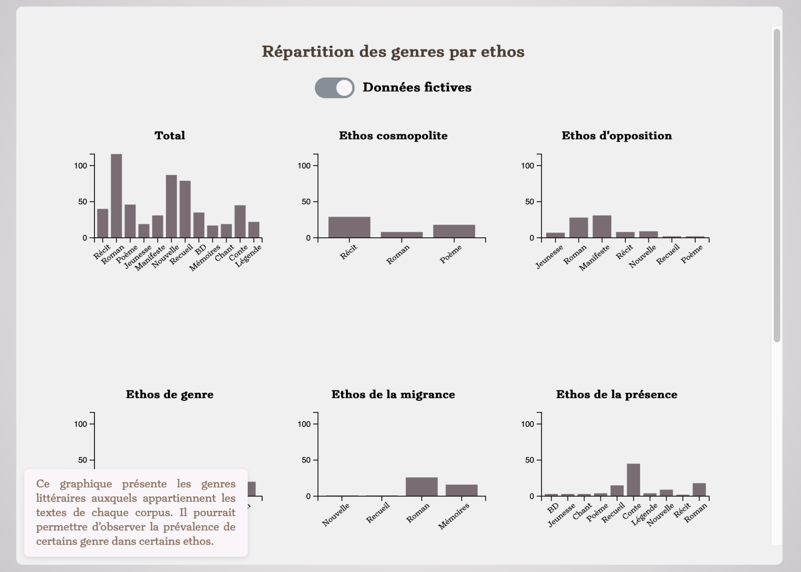

# Configuration EthoSpatiale : Pour une nouvelle histoire littéraire subsaharienne de langue française
# Une exposition en ligne comme point de départ d'hypothèses de recherche et de réflexions

## Présentation du projet et de ses fonctionnalités

**Configuration EthoSpatiale** est une exposition en ligne accompagnant un [projet de recherche](https://data.snf.ch/grants/grant/219693) financé par le Fonds National Suisse (FNS) et dirigé par Christine Le Quellec Cottier (Section de français, UNIL). Ce projet vise à réévaluer les classifications et périodisations traditionnelles qui définissent la catégorie « littérature subsaharienne de langue française ».

Le projet propose une nouvelle histoire littéraire fondée sur l’articulation de l’ethos (la voix énonciative et ses expressions) et de l’espace, en remettant en question les cadres hérités d’une approche européenne et colonialiste.

---

## Objectifs de l'exposition

* **Présenter une relecture critique et contextuelle** d’un siècle de création littéraire subsaharienne en langue française, en dépassant les approches essentialistes ou strictement chronologiques.
* **Mettre en valeur des corpus littéraires regroupés selon des critères formels et énonciatifs**, qui reflètent des relations plurielles au continent africain et au monde.
* **Explorer la notion d’ethos**, à travers la voix dominante dans les textes, et sa relation à l’espace.
* **Offrir une expérience interactive** autour des corpus littéraires, avec des outils de visualisation (cartes, frises chronologiques, graphiques) et des parcours thématiques.

---

## Contenu de l'exposition

* 3 **parcours thématiques** qui illustrent les différents axes du projet et leurs applications au corpus de textes.
  1. L’ethos comme clé de lecture
  2. Qu’est-ce qu’une littérature « africaine » ?
  3. L’histoire littéraire autrement : déconstruire les périodisations

* Un **dendrogramme** présentant la répartition des textes par ethos.

* Une **carte interactive** permettant d’explorer les rapports aux lieux.

* Une **frise chronologique** présentant les dates de parution de oeuvres du corpus.
* Un **graphique** présentant les voix narratives dominantes dans chaque ethos. 
* Un **graphique circulaire à plusieurs niveaux** (sunburst diagram) présentant la représentation des ethos primaires ainsi que les ethos secondaires, et les titres des livres qui font partie de ces catégories.
* Un ensemble d'**histogrammes** présentant les genres littéraires auxquels appartiennent les textes des corpus. 

---

## Images de l'exposition
  

  
   
  <em >Partie introductive, introduction aux 7 ethos.</em>
    
  

  

  
   
  <em>Dendrogramme présentant la répartition des textes par ethos.</em>
    
  

  

  
   
  <em>Carte interactive permettant de parcourir les lieux de déroulement des intrigues en fonction de l'ethos et de la date de publication.</em>
    
  

  

  
   
  <em>Graphique circulaire à plusieurs niveaux (sunburst diagram) présentant la représentation des ethos primaires ainsi que les ethos secondaires, et les titres des livres qui font partie de ces catégories. Ici, c'est l'ethos mémoriel qui est visible.</em>
    
  

  

  
   
  <em>Histogrammes présentant les genres littéraires auxquels appartiennent les textes des corpus. </em>
    
  

---

## Public visé

Cette exposition s’adresse principalement aux étudiant·e·s et aux chercheur·euse·s en littérature francophone africaine. 

### Public d'étudiant·e·s 
Elle est pensée pour servir de complément ou d'introduction à un cours ayant pour thème la littérature africaine francophone.
Elle a pour but d'introduire les étudiant·e·s à des concepts théoriques qui seront qui seront abordés plus en détail au cours de l'ensignement, et de les familiariser avec les corpus qui seront abordés.

### Public de chercheur·euse·s
Les visualisations présentées dans l'exposition peuvent servir d'outil de travail pour les chercheur·euse·s. En effet, leur observation permet de tisser des liens entre des données, d'observer des tendances et de les intérpréter.

---

## Procédure d’installation / de lancement

<ol>
<li>Cloner ou télécharger le projet.</li>
<li>Ouvrir le projet dans un éditeur compatible tel Visual Studio Code. </li>
<li>Installer l’extension Live Server.</li>
<li> Lancer le projet avec Live Server : Clic droit sur le fichier <em>presentation.html</em>, sélectionner "Open with Live Server".</li>
</ol>

---

## Framework et librairies utilisées
* [Reveal.js](https://github.com/hakimel/reveal.js/) : L'exposition est basée sur ce framework, permettant de créer des présentations en ligne. 

Les librairies utilisées au sein de ce projet sont incluses via des URL, et sont donc chargées automatiquement, pas besoin de les installer manuellement.
* [ D3.js ](https://d3js.org): Pour la création de l'ensemble d'histogrammes, du dendrogramme, du graphique circulaire à plusieurs niveaux, de la frise chronologique et du graphique.
* [Shepherd.js](https://www.shepherdjs.dev) : Pour les tours guidés de certains outils.
* [Leaflet ](https://leafletjs.com): Pour la carte interactive.
* [Papa parse](https://www.papaparse.com) : Pour la lecture de certains fichiers CSV en JavaScript.

---
## Copyright

### Framework : reveal.js
Copyright (C) 2011-2024 Hakim El Hattab, http://hakim.se, and reveal.js contributors

Permission is hereby granted, free of charge, to any person obtaining a copy
of this software and associated documentation files (the "Software"), to deal
in the Software without restriction, including without limitation the rights
to use, copy, modify, merge, publish, distribute, sublicense, and/or sell
copies of the Software, and to permit persons to whom the Software is
furnished to do so, subject to the following conditions:

The above copyright notice and this permission notice shall be included in
all copies or substantial portions of the Software.

THE SOFTWARE IS PROVIDED "AS IS", WITHOUT WARRANTY OF ANY KIND, EXPRESS OR
IMPLIED, INCLUDING BUT NOT LIMITED TO THE WARRANTIES OF MERCHANTABILITY,
FITNESS FOR A PARTICULAR PURPOSE AND NONINFRINGEMENT. IN NO EVENT SHALL THE
AUTHORS OR COPYRIGHT HOLDERS BE LIABLE FOR ANY CLAIM, DAMAGES OR OTHER
LIABILITY, WHETHER IN AN ACTION OF CONTRACT, TORT OR OTHERWISE, ARISING FROM,
OUT OF OR IN CONNECTION WITH THE SOFTWARE OR THE USE OR OTHER DEALINGS IN
THE SOFTWARE.

### Textes de l'exposition : références
<ul class="justify">
<li class="justify turnip-normal">Christine Le Quellec Cottier, « La littérature française au
							grand large », article en expertise. </li>
<li class="justify turnip-normal"> Ngugi Wa Thiong’o, <em>Décoloniser l’esprit </em>, traduit et
							préfacé par S.
							Prudhomme, Paris,
							La Fabrique, 2011 [1986]. </li>
<li class="justify turnip-normal">Guillaume Bridet, « Vers une histoire
							multiscalaire de la littérature française », <em> Revue d’Histoire littéraire de la
								France </em>, no 13, 2020, p. 193.</li>
</ul>

### Code 
ChatGPT a été utilisé pour écrire des parties de code de certaines visualisations.  
Certaines visualisations ont été adaptées d'exemples disponibles sur https://d3js.org.

---

## Contexte de développement
Ce projet a été développé dans le cadre du module "Projet en informatique pour les sciences humaines", sous la direction de Isaac Pante (SLI, Lettres, UNIL).

